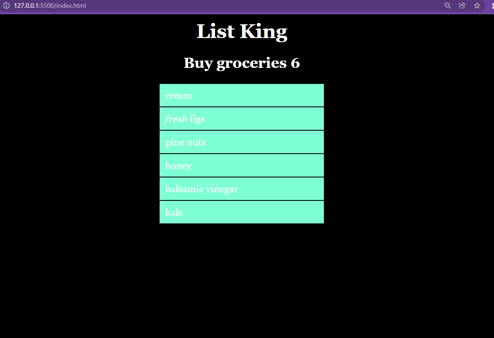

# Projeto-13-dias-Manipulando-DOM
O projeto 13 dias é uma meta que estabeleci para concluir neste período projetos baseados no livro JavaScript&amp;amp;jQuery - Jon Duckett. 
São 13 capitulos onde irei realizar/criar e refatorar os códigos ali apresentados afim de melhorar meu desempenho com esta incrível ferramenta que é o JS. 
Neste projeto simples o obletivo prinipal é manipular os elementos com o DOM.

